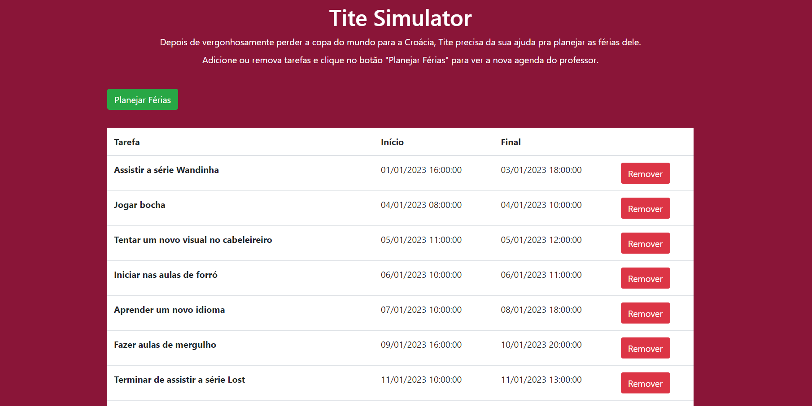
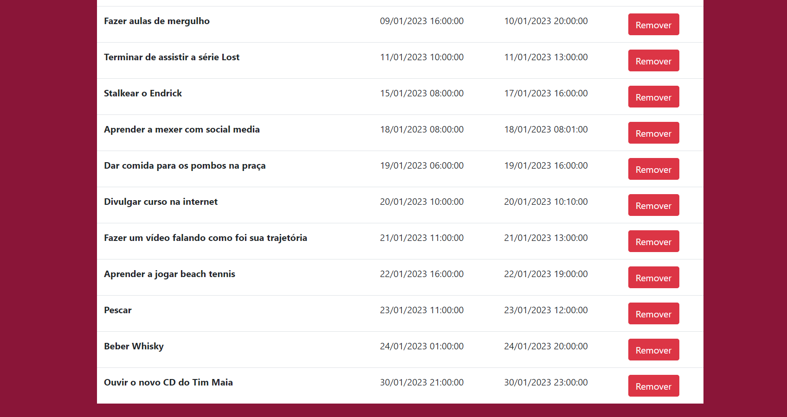

# Greed_TiteSimulator

**Número da Lista**: 16 
**Conteúdo da Disciplina**: Greed 

## Alunos
| Matrícula | Aluno                                                       |
| --------- | ----------------------------------------------------------- |
| 180063162 | [Daniel Primo](https://github.com/danieldagerom)        |
| 150011903 | [Igor Aragão](https://github.com/roginaldosemog)            |

## Sobre
O nosso professor Tite está está de férias, e precisando de organização para aproveitar fazendo o máximo de atividades possíveis.

## Screenshots

**Linguagem**: ReactJS, Javascript  

  

  

  

## Apresentação
O vídeo para apresentação se encontra disponível para baixar [AQUI](https://drive.google.com/file/d/1enBjE7iqKg-tahRYLXqJ7FrtqUC17NT4/view?usp=sharing)

## Uso
Abrir o index.html no seu navegador favorito.  
Também está disponível em https://titesimulator-greedy.netlify.app/